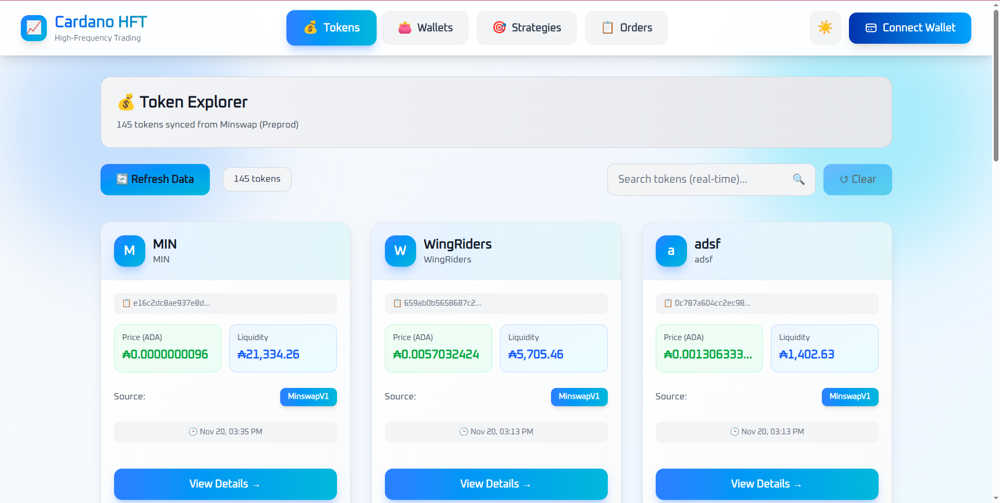
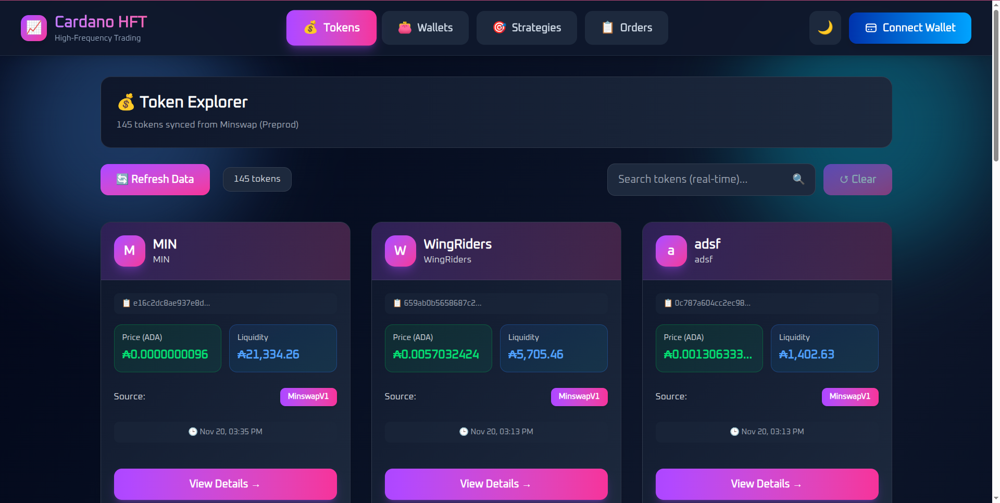
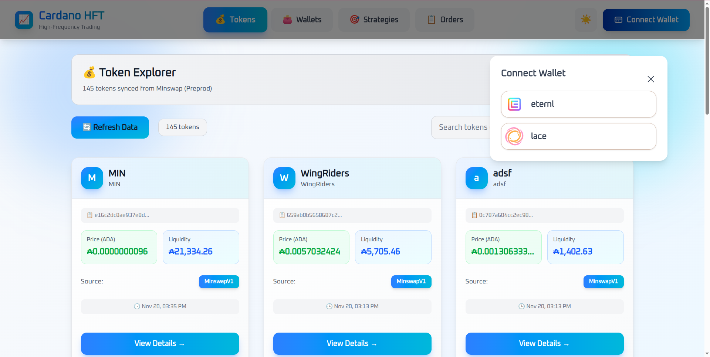
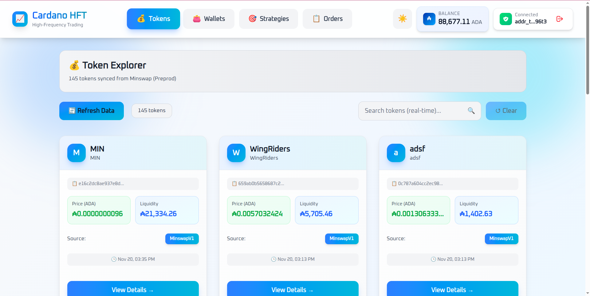
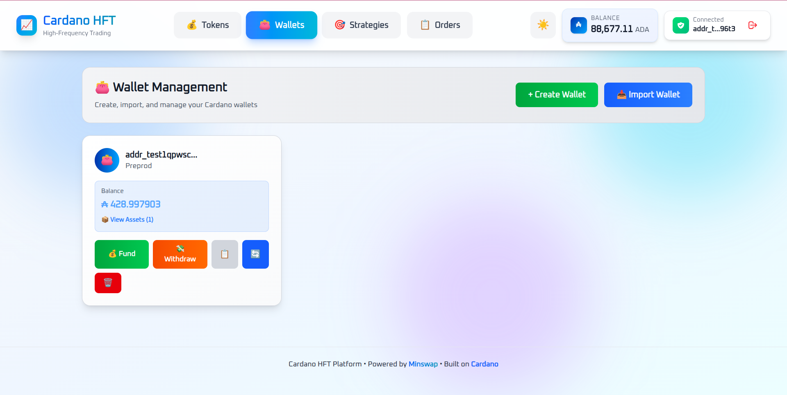
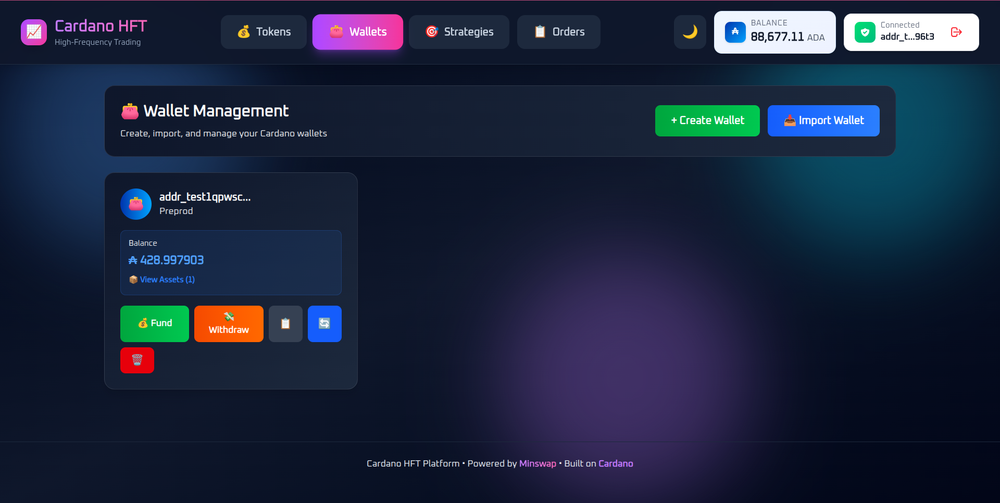
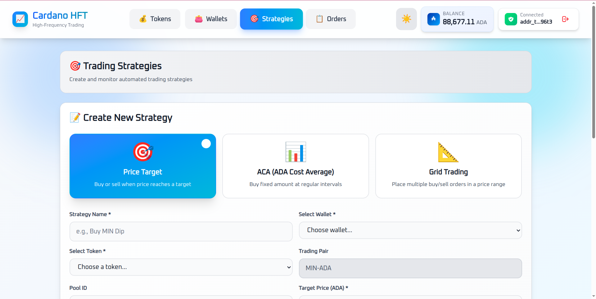
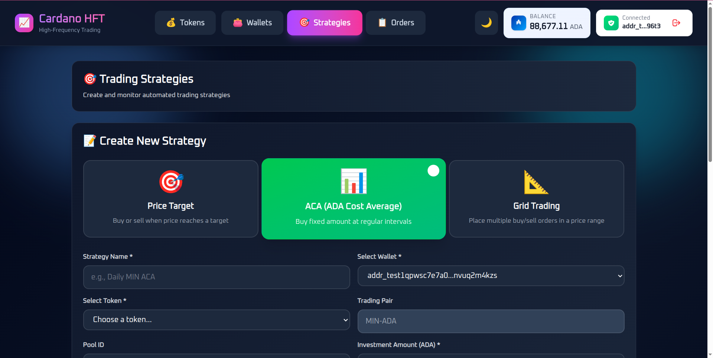
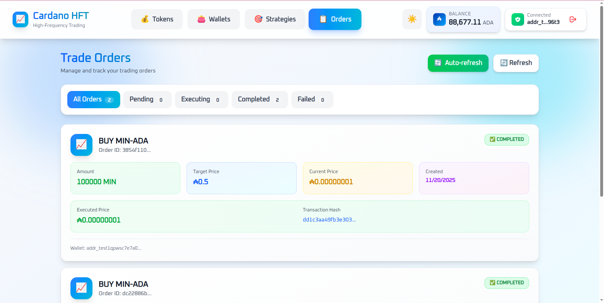
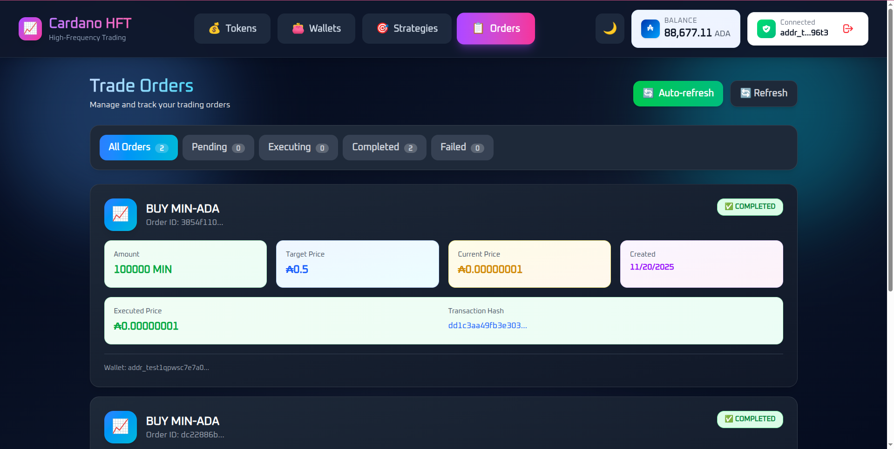

# Cardano High-Frequency Trading (ADA VELOCITY) Platform

> **A full-stack automated trading platform for Cardano blockchain with advanced algorithmic trading strategies**

## 📋 Table of Contents

- [Overview](#overview)
- [Key Features](#key-features)
- [Architecture](#architecture)
- [Flow Diagram](#flow-diagram)
- [Tech Stack](#tech-stack)
- [Project Structure](#project-structure)
- [Installation](#installation)
- [Configuration](#configuration)
- [Trading Strategies](#trading-strategies)
- [API Documentation](#api-documentation)
- [Security](#security)
- [Contributing](#contributing)
- [License](#license)
- [Acknowlegements](#acknowledgements)
- [Support](#support)
- [Screenshots](#screenshots)
- [Disclaimer](#disclaimer)

---

## 🎯 Overview

This platform is a sophisticated **automated trading system** designed specifically for the Cardano blockchain ecosystem. It enables users to execute algorithmic trading strategies with three core approaches: **Price Target**, **ADA Cost Averaging (ACA)**, and **Grid Trading**.

### What Problem Does It Solve?

- **Manual Trading Inefficiency**: Automates buy/sell decisions based on predefined strategies
- **24/7 Market Monitoring**: Never miss a trading opportunity with continuous price monitoring
- **Emotion-Free Trading**: Removes human bias and emotional decision-making
- **Complex Strategy Execution**: Implements advanced trading algorithms that would be impossible to execute manually

### Target Users

- Cryptocurrency traders on Cardano
- DeFi enthusiasts looking for automated yield strategies
- Developers building on Cardano who need trading infrastructure

---

## ✨ Key Features

### 🎯 **Three Trading Strategies**

1. **Price Target Strategy**

   - Execute trades when price reaches a specific threshold
   - Support for both "above" and "below" triggers
   - One-time or continuous execution modes

2. **ADA Cost Averaging (ACA)**

   - Invest fixed ADA amounts at regular intervals
   - Dollar-cost averaging to minimize volatility risk
   - Configurable intervals (5min to monthly)
   - Unlimited or limited execution runs

3. **Grid Trading**
   - Place multiple buy/sell orders within a price range
   - Profit from price oscillations
   - Configurable grid levels (2-50 levels)
   - Auto-calculates optimal grid spacing

### 🔐 **Secure Wallet Management**

- Encrypted seed phrase storage (AES-256)
- Support for multiple wallets per user
- Non-custodial (user retains full control)
- Testnet and Mainnet support

### 📊 **Real-Time Monitoring**

- Live strategy status dashboard
- WebSocket-based backend logs
- Price tracking with full decimal precision
- Order history and execution tracking

### 🌓 **Modern UI/UX**

- Dark/Light mode support
- Responsive design (mobile-friendly)
- Real-time price charts
- Toast notifications for important events

---

## 🏗️ Architecture

.png>)

## 🔄 Flow Diagram

.png>)

### Component Breakdown

**Frontend (React + TypeScript)**

- Redux for state management
- Axios for HTTP requests
- Socket.IO for real-time updates
- Tailwind CSS for styling

**Backend (Node.js + Express)**

- RESTful API design
- WebSocket for live logs
- Strategy execution engine
- Cardano blockchain integration via Lucid/Blockfrost

**Database**

- User Details
- Trade order tracking
- Token price history

**Blockchain Integration**

- Minswap SDK for DEX interactions
- Blockfrost API for blockchain queries
- Lucid for transaction building

---

## 🛠️ Tech Stack

### Frontend Technologies

| Technology           | Purpose                 |
| -------------------- | ----------------------- |
| **React 18**         | UI framework            |
| **TypeScript**       | Type-safe JavaScript    |
| **Redux Toolkit**    | State management        |
| **Tailwind CSS**     | Utility-first styling   |
| **Vite**             | Build tool & dev server |
| **Socket.IO Client** | Real-time communication |
| **Recharts**         | Price charts            |
| **Axios**            | HTTP client             |
| **Sonner**           | Toast notifications     |

### Backend Technologies

| Technology        | Purpose               |
| ----------------- | --------------------- |
| **Node.js**       | Runtime environment   |
| **Express**       | Web framework         |
| **TypeScript**    | Type-safe development |
| **Sequelize**     | ORM for database      |
| **Socket.IO**     | WebSocket server      |
| **Lucid Cardano** | Cardano transactions  |
| **Minswap SDK**   | DEX integration       |
| **Blockfrost**    | Blockchain API        |
| **JWT**           | Authentication        |
| **bcrypt**        | Password hashing      |

### Blockchain/Cardano

| Technology                    | Purpose                  |
| ----------------------------- | ------------------------ |
| **Cardano Testnet**           | Development environment  |
| **Minswap DEX**               | Decentralized exchange   |
| **Blockfrost API**            | Blockchain data provider |
| **Lucid**                     | Transaction builder      |
| **Cardano Serialization Lib** | CBOR encoding/decoding   |

---

## 📁 Project Structure

```

cardano-hft/
├── backend/ # Node.js backend server
│ ├── src/
│ │ ├── config/ # Configuration files
│ │ │ ├── db.ts # Database configuration
│ │ │ └── environment.ts # Environment variables
│ │ ├── controllers/ # Request handlers
│ │ │ └── wallet.controller.ts
│ │ ├── models/ # Database models
│ │ │ ├── token.model.ts
│ │ │ ├── tradeOrder.model.ts
│ │ │ └── user.model.ts
│ │ ├── routes/ # API routes
│ │ │ ├── strategy.routes.ts
│ │ │ ├── orders.routes.ts
│ │ │ └── wallet.routes.ts
│ │ ├── services/ # Business logic
│ │ │ ├── strategyManager.service.ts
│ │ │ ├── tradingBot.service.ts
│ │ │ └── logger.service.ts
│ │ ├── strategies/ # Trading strategies
│ │ │ ├── PriceTargetStrategy.ts
│ │ │ ├── ACAStrategy.ts
│ │ │ └── GridStrategy.ts
│ │ ├── utils/ # Utility functions
│ │ │ ├── encryption.util.ts
│ │ │ ├── price.util.ts
│ │ │ └── jwt.util.ts
│ │ └── index.ts # Entry point
│ ├── wallets/ # Encrypted wallet storage
│ └── package.json
│
├── frontend/ # React frontend
│ ├── src/
│ │ ├── components/ # React components
│ │ │ ├── strategies/ # Strategy forms
│ │ │ │ ├── PriceTargetForm.tsx
│ │ │ │ ├── ACAForm.tsx
│ │ │ │ └── GridTradingForm.tsx
│ │ │ ├── StrategyMonitor.tsx
│ │ │ └── WalletConnect.tsx
│ │ ├── pages/ # Page components
│ │ │ ├── TokensPage.tsx
│ │ │ ├── StrategiesPage.tsx
│ │ │ └── OrdersPage.tsx
│ │ ├── redux/ # Redux state
│ │ │ ├── store.ts
│ │ │ ├── authSlice.ts
│ │ │ ├── tokensSlice.ts
│ │ │ └── themeSlice.ts
│ │ ├── services/ # API clients
│ │ │ └── cardano.ts
│ │ └── App.tsx
│ └── package.json
│
└── docs/ # Documentation
├── Architecture(HFT).png
└── Flow Diagram(HFT).png

```

---

## 🚀 Installation

### Prerequisites

- **Node.js** >= 18.x
- **npm** or **yarn**
- **PostgreSQL** or **MySQL**
- **Cardano wallet** (for testnet/mainnet)
- **Blockfrost API key** ([Get one here](https://blockfrost.io))

### Step 1: Clone Repository

```

git clone https://github.com/AIQUANT-Tech/hft.git
cd hft

```

### Step 2: Backend Setup

```

cd backend
npm install

# Create .env.development file

cp .env.example .env.development

# Configure environment variables (see Configuration section)

nano .env.development

# Start backend server

npm run dev

```

Backend will run on `http://localhost:8080`

### Step 3: Frontend Setup

```

cd ../frontend
npm install

# Create .env file

cp .env.example .env

# Configure API URL

echo "VITE_API_URL=http://localhost:8080" > .env

# Start frontend dev server

npm run dev

```

Frontend will run on `http://localhost:3000`

---

## ⚙️ Configuration

### Backend Environment Variables

Create `backend/.env.development`:

```

# Server Configuration

PORT=8080
NODE_ENV=development

# Database Configuration

DB_HOST=localhost
DB_PORT=5432
DB_NAME=cardano_hft
DB_USER=your_db_user
DB_PASSWORD=your_db_password

# Blockfrost API (Testnet)

BLOCKFROST_PROJECT_ID=your_blockfrost_project_id
BLOCKFROST_URL=https://cardano-preprod.blockfrost.io/api/v0

# JWT Secret

JWT_SECRET=your_super_secret_jwt_key_change_this

# Encryption Key (32 characters)

ENCRYPTION_KEY=your_32_character_encryption_key

# Cardano Network

CARDANO_NETWORK=Preprod

```

### Frontend Environment Variables

Create `frontend/.env`:

```

VITE_API_URL=http://localhost:8080
VITE_NETWORK=Preprod

```

---

## 📈 Trading Strategies

### 1. Price Target Strategy

**Use Case**: Execute trades when price reaches a specific level

**Example Configuration**:

```

{
"name": "Buy MIN Dip",
"tradingPair": "MIN-ADA",
"targetPrice": 0.000000009,
"orderAmount": 1000000,
"side": "BUY",
"triggerType": "BELOW",
"executeOnce": true
}

```

**How It Works**:

1. Monitors current price every 5 seconds
2. When price falls below 0.000000009 ADA
3. Executes buy order for 1,000,000 MIN tokens
4. Stops after first execution (if `executeOnce: true`)

---

### 2. ADA Cost Averaging (ACA)

**Use Case**: Invest fixed amounts at regular intervals to minimize volatility risk

**Example Configuration**:

```

{
"name": "Daily MIN DCA",
"tradingPair": "MIN-ADA",
"investmentAmount": 100,
"intervalMinutes": 1440,
"totalRuns": 30,
"executeOnce": false
}

```

**How It Works**:

1. Every 24 hours (1440 minutes)
2. Buys MIN tokens worth 100 ADA
3. Repeats for 30 total purchases
4. Averages out price over time

**Benefits**:

- Reduces impact of volatility
- No need to time the market
- Consistent investment schedule

---

### 3. Grid Trading

**Use Case**: Profit from price oscillations within a defined range

**Example Configuration**:

```

{
"name": "MIN Grid 10%",
"tradingPair": "MIN-ADA",
"lowerPrice": 0.0000000086,
"upperPrice": 0.0000000105,
"gridLevels": 10,
"investmentPerGrid": 20,
"executeOnce": false
}

```

**How It Works**:

1. Creates 10 price levels between lower and upper bounds
2. Places buy orders below current price
3. Places sell orders above current price
4. When price moves up, sells; when down, buys
5. Profits from each grid level crossing

**Grid Levels Example**:

```

Level 10 (Sell): 0.0000000105 ADA ← Upper bound
Level 9 (Sell): 0.0000000103 ADA
Level 8 (Sell): 0.0000000100 ADA
Level 7 (Sell): 0.0000000098 ADA
Level 6 (Sell): 0.0000000095 ADA
─────────────────────────────────── Current Price: 0.0000000095
Level 5 (Buy): 0.0000000093 ADA
Level 4 (Buy): 0.0000000091 ADA
Level 3 (Buy): 0.0000000088 ADA
Level 2 (Buy): 0.0000000086 ADA ← Lower bound
Level 1 (Buy): 0.0000000086 ADA

```

---

## 🔌 API Documentation

### Base URL

```

http://localhost:8080/api

```

### Authentication Endpoints

#### Register/Login User

```

POST /api/auth/connect - Connect wallet and get JWT
Content-Type: application/json

{
"walletAddress": "test_addr1234",
}

```

**Response**:

```

{
   success: true,
   user: {
     id: userId,
     walletAddress: userWalletAddress,
     displayName: user.get("displayName"),
     email: user.get("email"),
     avatarUrl: user.get("avatarUrl"),
     bio: user.get("bio"),
     createdAt: user.get("createdAt"),
   },
   isNewUser: !user.get("displayName"),
}

```

---

### Strategy Endpoints

#### Create Price Target Strategy

```

POST /strategy/price-target
Authorization: Bearer <jwt_token>
Content-Type: application/json

{
"name": "Buy MIN Dip",
"walletAddress": "addr_test1...",
"tradingPair": "MIN-ADA",
"baseToken": "policyId.assetName",
"quoteToken": "ADA",
"targetPrice": 0.000000009,
"orderAmount": 1000000,
"side": "BUY",
"triggerType": "BELOW",
"executeOnce": true,
"poolId": "pool_id_here"
}

```

#### Create ACA Strategy

```

POST /strategy/aca
Authorization: Bearer <jwt_token>
Content-Type: application/json

{
"name": "Daily MIN DCA",
"walletAddress": "addr_test1...",
"tradingPair": "MIN-ADA",
"baseToken": "policyId.assetName",
"investmentAmount": 100,
"intervalMinutes": 1440,
"totalRuns": 30,
"poolId": "pool_id_here"
}

```

#### Get Active Strategies

```

GET /strategy/live
Cookies: <jwt_token>

```

**Response**:

```

{
"success": true,
"strategies": [
{
"id": "uuid",
"name": "Buy MIN Dip",
"tradingPair": "MIN-ADA",
"currentPrice": 0.000000009619,
"targetPrice": 0.000000009,
"conditionMet": false
}
]
}

```

#### Stop Strategy

```

POST /strategy/stop/:strategyId
Cookies: <jwt_token>

```

#### Delete Strategy

```

DELETE /strategy/:strategyId
Cookies: <jwt_token>

```

---

### Wallet Endpoints

#### Create Wallet

```

POST /wallet/create
Authorization: Cookies <jwt_token>
Content-Type: application/json

{
user?: {
    userId: number;
    walletAddress: string;
  };
}

```

**Response**:

```

{
"success": true,
"wallet": {
"address": "addr_test1qpwsc7e7...",
"mnemonic": "24-word seed phrase here"
}
}

```

⚠️ **Important**: Save the mnemonic securely! It's shown only once.

#### List Wallets

```

GET /wallet/list
Authorization: Cookies <jwt_token>

```

---

### Order Endpoints

#### Get All Orders

```

GET /orders
Authorization: Cookies <jwt_token>

```

**Response**:

```

{
"success": true,
"orders": [
{
"id": "uuid",
"tradingPair": "MIN-ADA",
"isBuy": true,
"amount": 1000000,
"targetPrice": "0.000000009",
"currentPrice": "0.000000009619",
"status": "pending",
"createdAt": "2025-11-20T10:00:00Z"
}
]
}

```

#### Delete Order

```

DELETE /orders/:orderId
Authorization: Cookies <jwt_token>

```

---

## 🔒 Security

### Encryption

- **Seed phrases** are encrypted using **AES-256-CBC**
- Encryption key stored in environment variables
- **Never** commit `.env` files to git

### Authentication

- JWT-based authentication with HTTP-only cookies
- Passwords hashed with **bcrypt** (10 rounds)
- Token expiration after 24 hours

### Best Practices

1. **Never share your seed phrase**
2. Use strong passwords (12+ characters)
3. Enable 2FA on Blockfrost account
4. Run on testnet before mainnet
5. Start with small amounts
6. Monitor strategies regularly

---

## 🤝 Contributing

We welcome contributions! Please follow these steps:

1. **Fork** the repository
2. Create a **feature branch** (`git checkout -b feature/amazing-feature`)
3. **Commit** your changes (`git commit -m 'Add amazing feature'`)
4. **Push** to the branch (`git push origin feature/amazing-feature`)
5. Open a **Pull Request**

### Code Style

- Follow TypeScript best practices
- Use meaningful variable names
- Add comments for complex logic
- Write tests for new features

---

## 📝 License

This project is licensed under the **MIT License** - see the [LICENSE](LICENSE) file for details.

---

## 🙏 Acknowledgments

- **Cardano Foundation** for blockchain infrastructure
- **Minswap** for DEX integration
- **Blockfrost** for API services
- **Lucid** for transaction building library

---

## 📞 Support

- **Issues**: [GitHub Issues](https://github.com/AIQUANT-Tech/hft.git/issues)
- **Discussions**: [GitHub Discussions](https://github.com/AIQUANT-Tech/hft.git/discussions)
- **Email**: rayan.ahmad@aiquantgroup.com

---

## 📸 Screenshots





















## ⚠️ Disclaimer

**Cryptocurrency trading carries significant risks. Always:**

- Do your own research (DYOR)
- Never invest more than you can afford to lose
- Test thoroughly on testnet before mainnet
- Understand tax implications in your jurisdiction
- Consult financial advisors

The developers are not responsible for any financial losses incurred while using this software.

---

**Made with ❤️ for the Cardano community**

```

```
